# Vehicle Detection Project

The goal of this project was to create a vehicle detection pipeline. This project is part of the Udacity Self Driving Car Nanodegree (https://www.udacity.com/drive) .

![alt text][image9]

The steps that were taken:

* Performed a Histogram of Oriented Gradients (HOG) feature extraction on a labeled training set of images
* Train a classifier Linear SVM classifier
* Apply a color transform and append binned color features, as well as histograms of color, to HOG feature vector 
* Implemented a sliding-window technique and used the trained classifier to search for vehicles in images.
* Create a heat map of recurring detections frame by frame to reject outliers and follow detected vehicles.
* Estimate a bounding box for vehicles detected in each frame of a video.

[//]: # (Image References)
[image1]: ./images/vehicle.png
[image8]: ./images/non_vehicle.png
[image2]: ./images/HOG_example.jpg
[image3]: ./examples/sliding_windows.jpg
[image4]: ./examples/sliding_window.jpg
[image5]: ./examples/bboxes_and_heat.png
[image6]: ./examples/labels_map.png
[image7]: ./examples/output_bboxes.png
[image9]: ./vehicle-detection-snap.png
[video1]: ./project_detection_video.mp4

### Histogram of Oriented Gradients (HOG)

#### 1. I extracted HOG features from the training images.

The code for this step is contained in  in lines 66 through 99 of the file called `classify.py` using the function extract_features() which is in `processing.py`.

I started by reading in all the `vehicle` and `non-vehicle` images.  Here is an example of one of each of the `vehicle` and `non-vehicle` classes:

** Example of Vehicle **
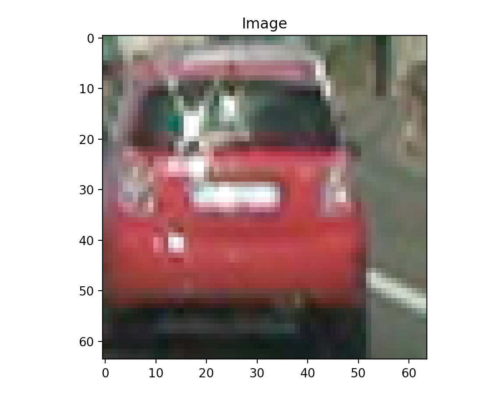 

** Example of Non Vehicle **
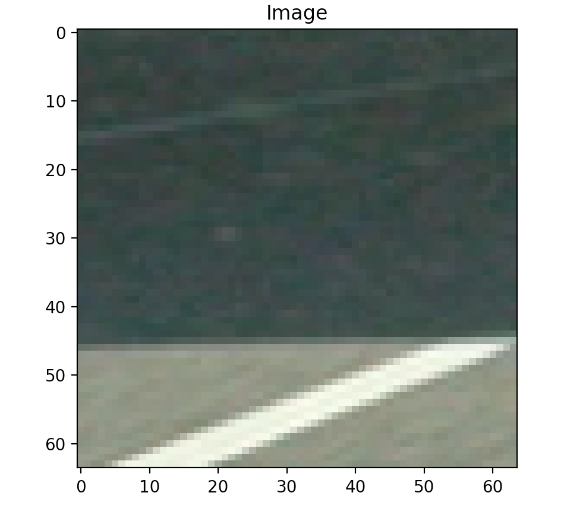

I then explored different color spaces and different `skimage.hog()` parameters (`orientations`, `pixels_per_cell`, and `cells_per_block`).  I grabbed random images from each of the two classes and displayed them to get a feel for what the `skimage.hog()` output looks like.

Here is an example using the `YCrCb` color space and HOG parameters of `orientations=9`, `pixels_per_cell=(8, 8)` and `cells_per_block=(2, 2)`:
** Vehicle **

 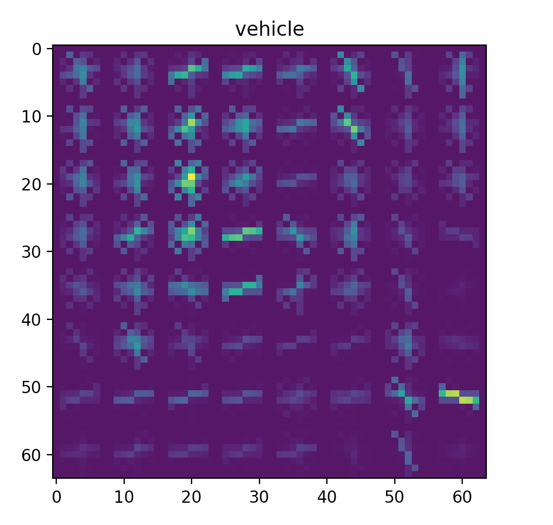

** Non Vehicle ** 

 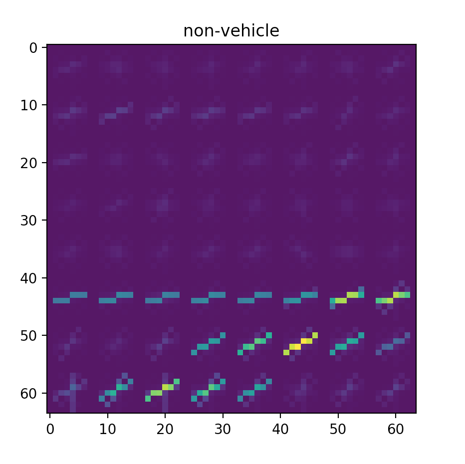

#### 2. My choice of HOG parameters.

I tried various combinations of parameters and applied them on to separate test images. I measured the time taken to create a HOG image and the tradeoff on the difference between the output visualizations. I settled on sticking with the orientations=9, pixels_per_cell=(8,8) and cells_per_block=(2,2). 

#### 3. Training HOG features and color features.

I trained a linear SVM using sklearn in `classify.py` 167 to 190. 

I add color features as well by including spatial binning of a resized image and a color histogram to the feature set. 

### Sliding Window Search

#### 1. Specifics of search

I implemented a sliding window search in find_cars() in `processing.py` lines 62 to 149. 

I looped through the scale in steps of 0.1 from 0.4 to 3.0. I saved each output and went through them manually using the test images. I saw that after a scale of 2.4 or so there didn't seem to be many useful predictions. 

#### 2. Test images to demonstrate how your pipeline is working & optimizations

Ultimately I searched on 5 scales using YCrCb 3-channel HOG features plus spatially binned color and histograms of color in the feature vector, which provided a nice result.  Here are some example images:

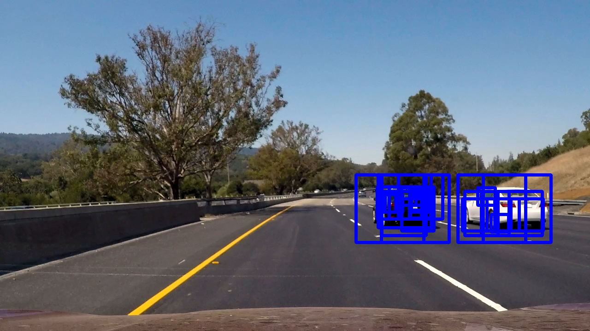 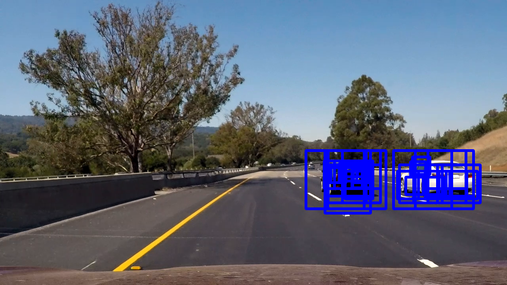

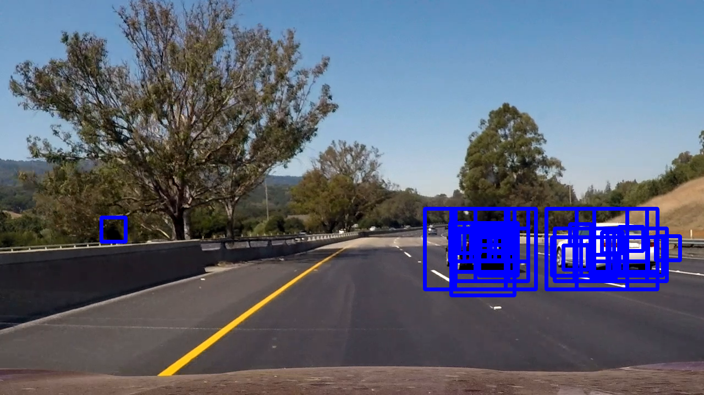 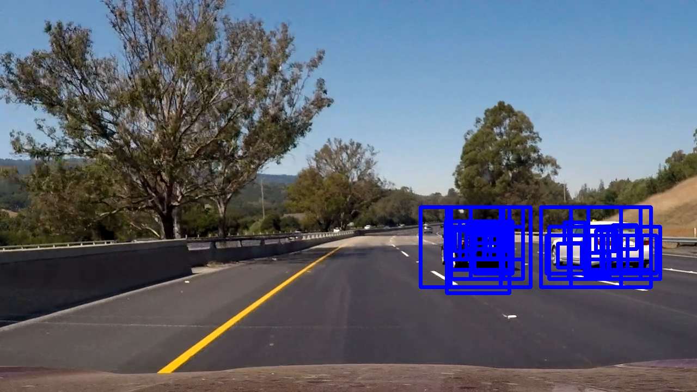

---

### Video Implementation

#### 1. Final video output

Here's a [link to my video result](./project_detection_video.mp4)

#### 2. Filtering for false positives and method for combining overlapping bounding boxes.

I recorded the positions of positive detections in each frame of the video.  From the positive detections I created a heatmap and then thresholded that map to identify vehicle positions.  I then used `scipy.ndimage.measurements.label()` to identify individual blobs in the heatmap.  I then assumed each blob corresponded to a vehicle.  I constructed bounding boxes to cover the area of each blob detected.  

Here's an example result showing the heatmap from a series of frames of video, the result of `scipy.ndimage.measurements.label()` and the bounding boxes then overlaid on the last frame of video:

### Here are six frames  and their corresponding heatmaps:

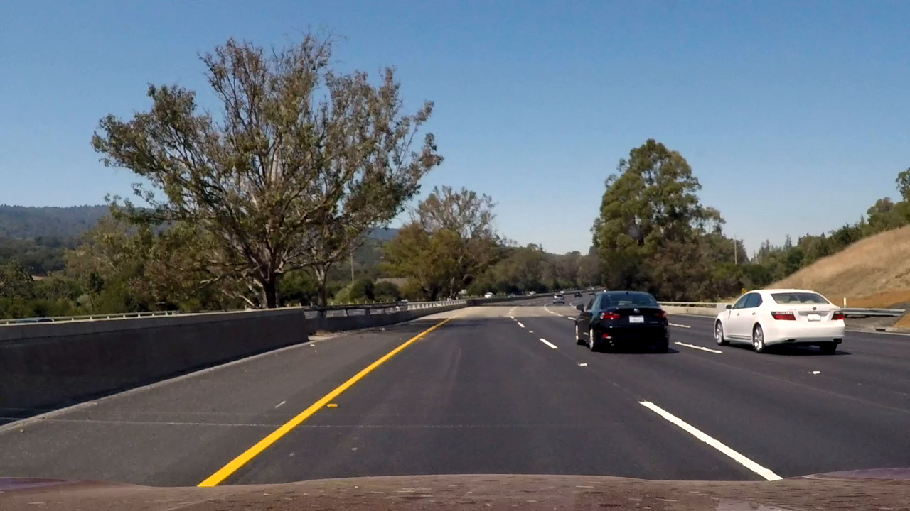 

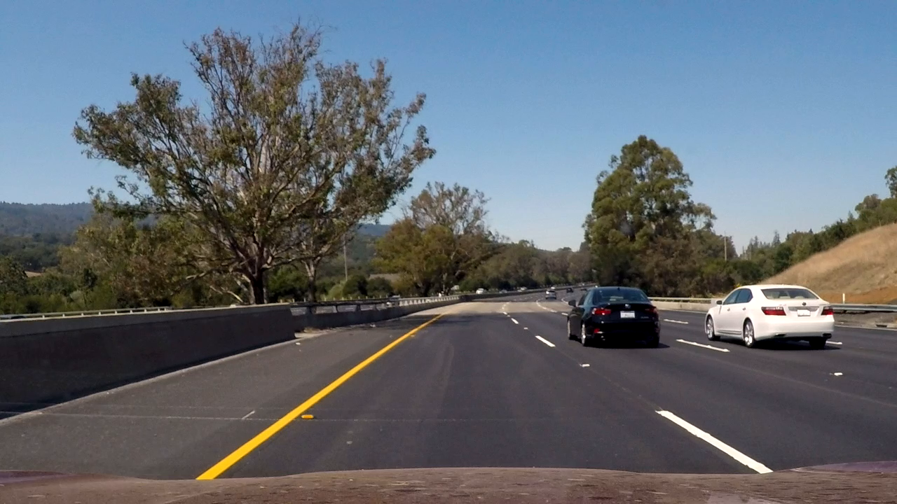 

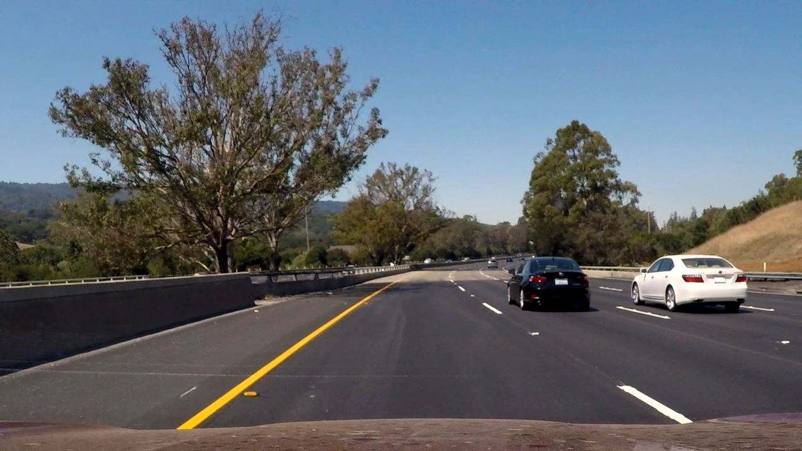 

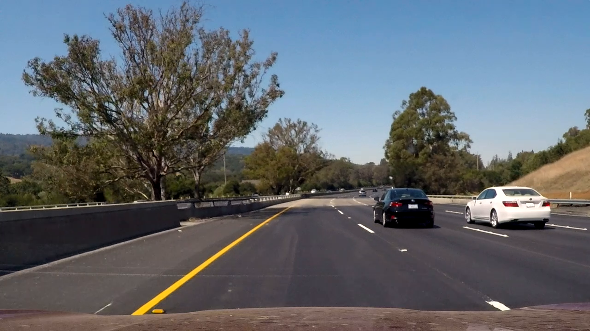 

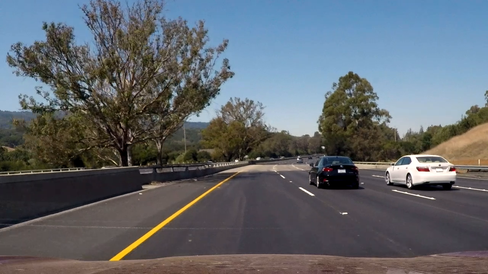 

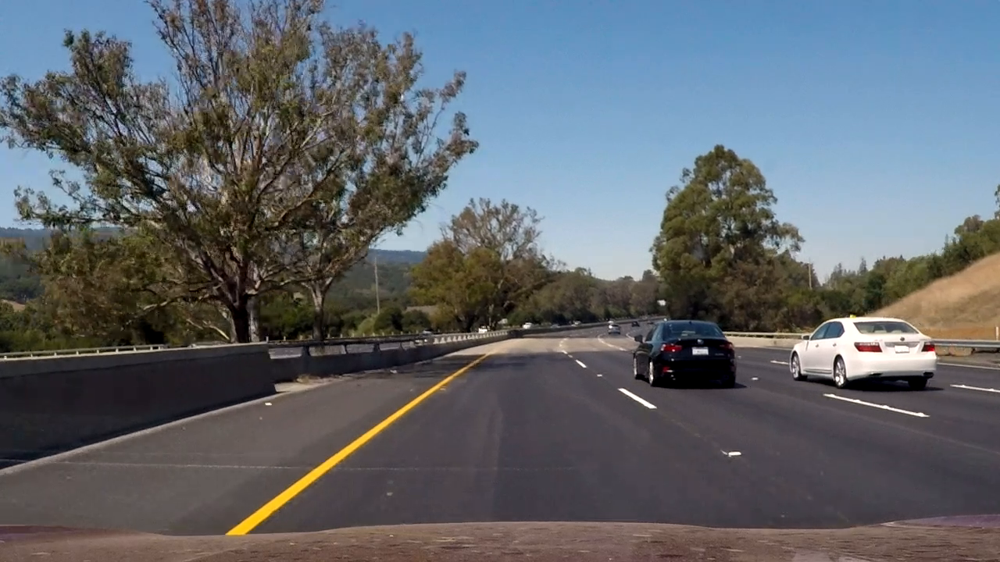 

### Here is the output of `scipy.ndimage.measurements.label()` on the integrated heatmap from all six frames:

</img>

### Here the resulting bounding boxes are drawn onto the last frame in the series:

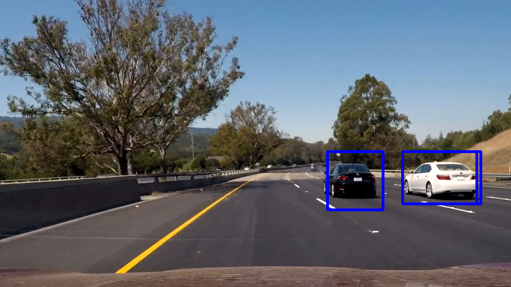</img>

---

### Discussion

#### 1. Future Work

I think the algo would fail if it was snowing heavily. I think we would need a different set of features in those conditions for the detection algorithm to work. I could maybe add colors and train with images of cars in different weather conditions - snow, rain, high sunlight, running in a tunnel etc.

I also wonder if it would make sense to change to make the features color invariant as the images we trained on are from computer games and may not represent the set of real cars very well. Also the shapes of cars will change in the future so we need to think broader in terms of shapes. 

Also for example motorcycles and other forms of transport aren't in the training set so we really need to be able to differentiate the foreground - i.e. things moving as fast as the car and the background which is stationary. I think this would be a better method. 

